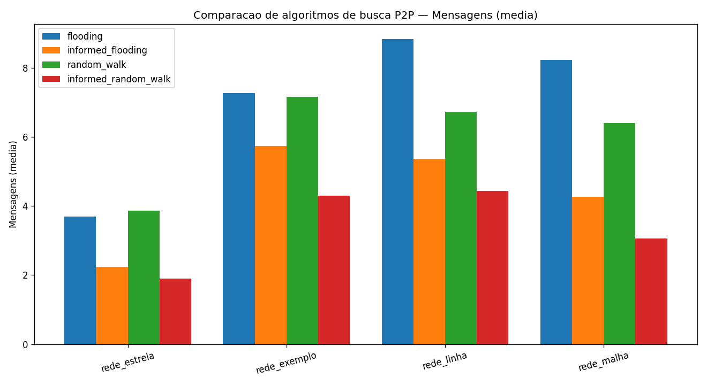
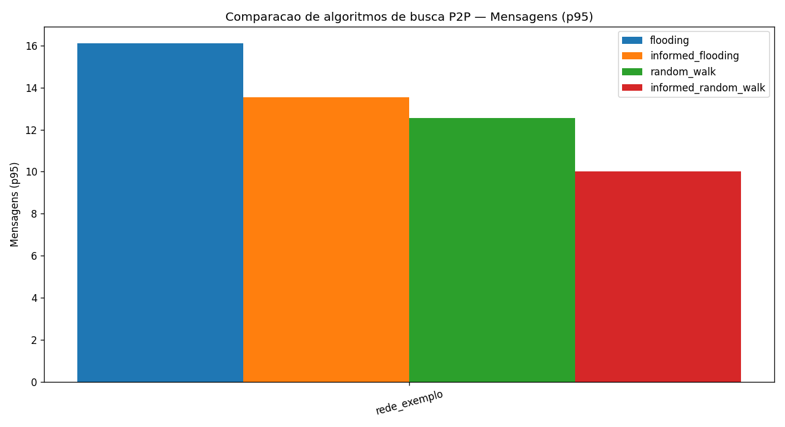
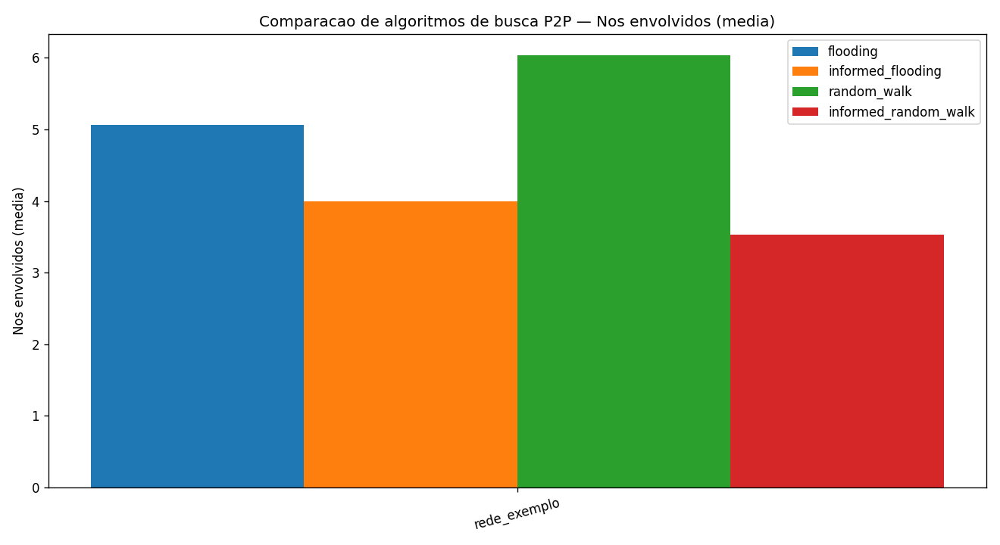
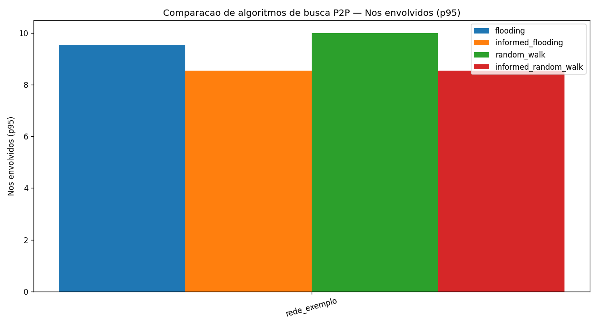
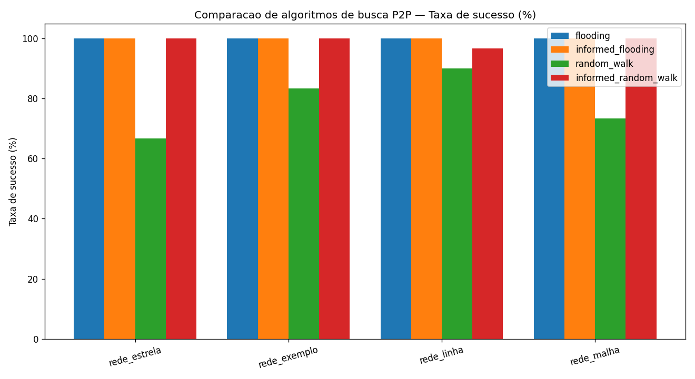

# Simulador de Busca em Sistemas P2P

Este projeto é uma implementação, em Python, de um simulador de buscas em redes
P2P não estruturadas. A ideia é representar uma rede formada por vários nós
(peers), onde cada nó conhece apenas os seus vizinhos diretos e guarda uma lista
própria de recursos.

A partir dessa rede, o programa permite procurar um recurso usando diferentes
estratégias de busca. No final de cada execução, ele mostra se o recurso foi
encontrado, em qual nó ele estava, quantas mensagens foram trocadas e quantos nós
participaram da busca.

O projeto foi desenvolvido para o Trabalho 7 da disciplina de Computação
Distribuída, ministrada pelo professor Nabor C. Mendonça.

## Integrantes

| Nome | Matrícula |
|---|---:|
| Caio Barros da Costa | 2315082 |
| Kaíke Petelas | 2310331 |
| Leonardo de Saboia | 2310333 |
| Gustavo Sousa | 2315053 |

## O que o simulador faz

O simulador trabalha com uma rede P2P descrita em um arquivo de configuração.
Esse arquivo informa quantos nós existem, quantos vizinhos cada nó pode ter,
quais recursos cada nó possui e quais conexões existem entre os nós.

Depois que a rede é carregada, o programa valida se ela está correta e permite:

- visualizar a estrutura da rede;
- executar buscas por recursos;
- comparar diferentes algoritmos;
- contar mensagens trocadas durante a busca;
- contar os nós envolvidos;
- animar graficamente o caminho percorrido pelas mensagens;
- gerar gráficos de benchmark para comparar o comportamento dos algoritmos.

## Algoritmos implementados

Foram implementadas quatro estratégias de busca:

| Algoritmo | Ideia principal |
|---|---|
| `flooding` | O nó envia a consulta para todos os vizinhos, que repetem o processo até encontrar o recurso ou o TTL acabar. |
| `random_walk` | A consulta segue por apenas um vizinho por vez, escolhido de forma aleatória. |
| `informed_flooding` | Funciona como o flooding, mas usa cache para aproveitar informações aprendidas em buscas anteriores. |
| `informed_random_walk` | Funciona como o random walk, mas também usa cache para tentar caminhar em direção a um nó que já se sabe possuir o recurso. |

Na prática, o `flooding` costuma encontrar recursos com mais facilidade, mas
gera muitas mensagens. O `random_walk` economiza mensagens, porém pode falhar se
o TTL for baixo ou se a escolha aleatória não levar ao recurso. As versões
`informed_*` melhoram com o tempo, porque os nós passam a guardar informações de
localização aprendidas durante buscas anteriores.

## Requisitos

O projeto usa Python e algumas bibliotecas para visualização e gráficos.

```bash
pip install networkx matplotlib pandas
```

O `networkx` e o `matplotlib` são usados para desenhar a rede, animar buscas e
gerar os gráficos. O `pandas` aparece como dependência opcional para facilitar
análises, mas o núcleo do simulador não depende dele.

## Como executar

Para abrir o menu interativo sem carregar nenhuma rede:

```bash
python p2p.py
```

Para abrir o menu já carregando uma rede de exemplo:

```bash
python p2p.py configs/rede_exemplo.txt
```

No menu, as opções disponíveis são:

1. carregar um arquivo de configuração;
2. validar a rede;
3. desenhar a rede;
4. buscar um recurso;
5. rodar os testes comparativos;
6. limpar o cache das buscas informadas;
0. sair.

Durante uma busca, o programa pede o nó de origem, o recurso desejado, o TTL e o
algoritmo. O TTL funciona como um limite de profundidade: ele impede que a busca
continue indefinidamente pela rede.

## Como rodar os benchmarks

Para comparar os algoritmos usando todas as redes dentro da pasta `configs/`:

```bash
python benchmark.py
```

Para rodar o benchmark em uma rede específica:

```bash
python benchmark.py configs/rede_malha.txt
```

O benchmark executa buscas repetidas, calcula médias e percentis, imprime uma
tabela no terminal e salva os gráficos em arquivos PNG.

As métricas analisadas são:

- mensagens médias trocadas;
- percentil 95 de mensagens trocadas;
- média de nós envolvidos;
- percentil 95 de nós envolvidos;
- taxa de sucesso.

O percentil 95, também chamado de p95, ajuda a observar os casos mais pesados:
ele mostra um valor abaixo do qual ficaram 95% das execuções.

## Resultados dos benchmarks

Os gráficos abaixo foram gerados pelo `benchmark.py` e mostram a comparação entre
os quatro algoritmos nas topologias de teste do projeto.

### Mensagens médias



### Percentil 95 de mensagens



### Nós envolvidos em média



### Percentil 95 de nós envolvidos



### Taxa de sucesso



## Formato do arquivo de configuração

Cada rede fica em um arquivo `.txt`. O formato esperado é este:

```txt
num_nodes: 12
min_neighbors: 2
max_neighbors: 4
resources:
  n1: r1, r2, r3
  n2: r4, r5
edges:
  n1, n2
  n1, n3
```

A seção `resources` indica quais recursos pertencem a cada nó. A seção `edges`
define as conexões da rede. Como a rede é não direcionada, a conexão `n1, n2`
significa que `n1` é vizinho de `n2` e `n2` também é vizinho de `n1`.

## Validações da rede

Antes de permitir uma busca, o programa verifica se a rede carregada é válida.
As validações implementadas são:

1. a quantidade de nós declarada em `num_nodes` precisa bater com os nós encontrados no arquivo;
2. a rede não pode estar particionada;
3. cada nó precisa respeitar os limites `min_neighbors` e `max_neighbors`;
4. todo nó precisa possuir pelo menos um recurso;
5. não pode existir aresta de um nó para ele mesmo.

Se alguma dessas regras falhar, o programa mostra o problema e impede a busca
até que o arquivo de configuração seja corrigido.

## Contagem de mensagens

Para comparar os algoritmos de forma justa, o projeto usa uma regra simples:
uma mensagem corresponde a uma consulta trafegando por uma aresta, de um nó para
um vizinho.

No `flooding`, mensagens enviadas para nós que já foram visitados também são
contadas. Isso é importante porque representa o desperdício natural da
inundação. Quando o recurso é encontrado, o programa também contabiliza as
mensagens de resposta que voltam até o nó de origem.

Os nós envolvidos são todos os nós que receberam ou processaram a consulta em
algum momento da busca.

## Estrutura dos arquivos

| Arquivo | Função |
|---|---|
| `p2p.py` | menu interativo e ponto de entrada principal do projeto |
| `network.py` | leitura dos arquivos de configuração, modelo da rede e validações |
| `search.py` | implementação dos quatro algoritmos de busca |
| `visualize.py` | desenho da rede e animação das buscas |
| `benchmark.py` | execução dos testes comparativos e geração dos gráficos |
| `configs/` | redes de exemplo usadas para testes |
| `benchmark_*.png` | imagens geradas pelos benchmarks |

## Observações finais

O projeto permite observar bem o custo de cada abordagem. O flooding tende a ser
mais agressivo e espalha a busca rapidamente, enquanto o random walk é mais
econômico, mas menos previsível. As estratégias informadas mostram o efeito do
aprendizado local em redes P2P: depois que uma informação entra no cache, buscas
seguintes podem precisar de menos mensagens para chegar ao mesmo recurso.
